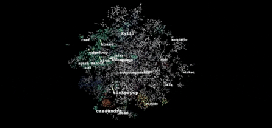

<h1 align="center">

 </h1>

    

 

 
 
 
 

  

---

### :man_technologist: About Me :

I am a FullStack Developer  specializing on .NET Technology.
- 🌱currently digging on **SQL-Server** , **T-SQL** , **Advanced C#** , **RESTful API** ,  **Asp.Net MVC** , **ReactJS** ...
  
- 👯 I’m looking to collaborate on open source projects
  
- :zap: In my free time, I solve problems on CodeForce, LeetCode and read tech articles.

- :mailbox:How to reach me: 
  
---

### :hammer_and_wrench: Languages and Tools :

<table align="center" bgcolor="#000000" cellpadding="25" cellspacing="0" width="100%">
<tr>
<td align="center" bgcolor="#000000">

</td>
</tr>
<tr>
<td align="center" bgcolor="#000000">

</td>
</tr>
</table>

---

### :fire: My Stats :

      
 

---

### 🏆 My Trophies :

